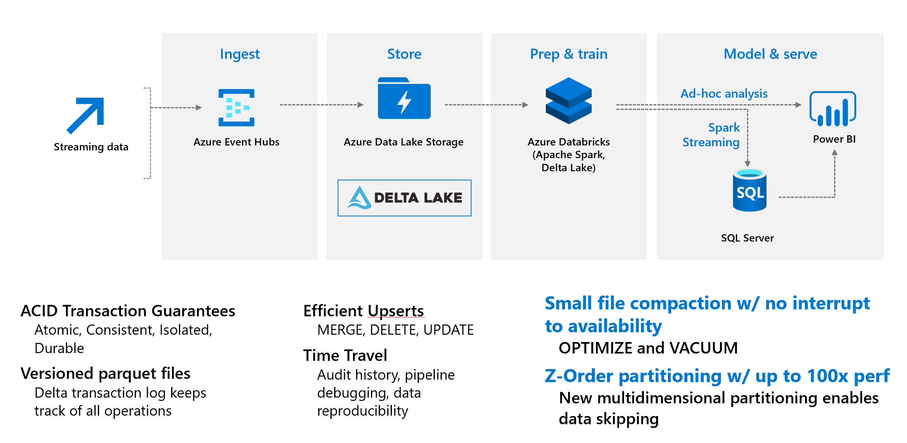
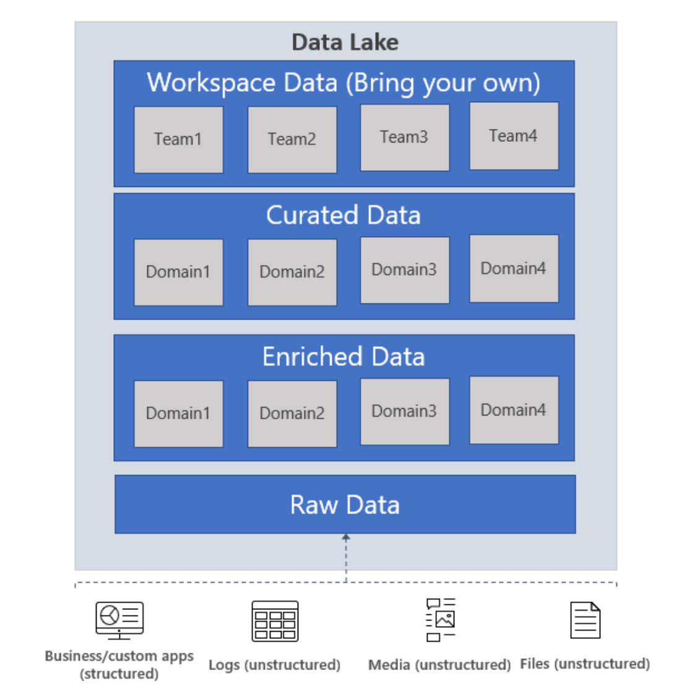

IoT Streaming Use Case
======================

# Objective

Objective of this hackathon is to gain a better understanding of how to leverage a modern data lake architecture leverage with Structured Streaming to enable IoT Use cases.  





Key Components to investigate during the hackathon include:

- ADLS Gen2
- Databricks (Delta Lake Technology with Spark Streaming)
- Event Hubs
- Azure Key Vault
- Create a SQL Database

# Prereqs

- Azure Subscription
- Service Principal for mounting to the datalake (ideally 2)
- [Storage Explorer](https://azure.microsoft.com/en-us/features/storage-explorer/)
- Visual Studio or VS Code

# Creating Resources Components & Resource Considerations

## Azure ADLS Gen 2

An enterprise data lake is designed to be a central repository of unstructured , semi-structured and structured data used in your big data platform. The goal of the enterprise data lake is to eliminate data silos (where the data can only be accessed by one part of your organization) and promote a single storage layer that can accommodate the various data needs of the organization.

ADLS Gen2 is an enterprise ready hyperscale repository of data for your big data analytics workloads. ADLS Gen2 offers faster performance and Hadoop compatible access with the hierarchical namespace, lower cost and security with fine grained access controls and native AAD integration. This lends itself as the choice for your enterprise data lake focused on big data analytics scenarios – extracting high value structured data out of unstructured data using transformations, advanced analytics using machine learning or real time data ingestion and analytics for fast insights.

Azure Data Lake Storage Gen2 implements an access control model that supports both Azure role-based access control (Azure RBAC) and POSIX-like access control lists (ACLs) providing R/W/Execute permission.


### ADLS Gen 2 Defintiions
**Container**: A container organizes a set of objects (or files). A storage account has no limits on the number of containers, and the container can store an unlimited number of folders and files. There are properties that can be applied at a container level such as RBACs and SAS keys.

**Folder/Directory:** A folder (also referred to as a directory) organizes a set of objects (other folders or files). There are no limits on how many folders or files can be created under a folder. A folder also has access control lists (ACLs) associated with it, there are two types of ACLs associated with a folder – access ACLs and default ACLs.  Default ACLs are templates of ACLs associated with a directory that determine the access ACLs for any child items that are created under that directory. Files do not have default ACLs.

**Object/file:** A file is an entity that holds data that can be read/written. A file has an access control list associated with it. A file has only access ACLs and no default ACLs.

### Do I want a centralized or a federated data lake implementation?
As an enterprise data lake, you have two available options – either centralize all the data management for your analytics needs within one organization, or have a federated model, where your customers manage their own data lakes while the centralized data team provides guidance and also manages a few key aspects of the data lake such as security and data governance. It is important to remember that both the centralized and federated data lake strategies can be implemented with one single storage account or multiple storage accounts.

A common question our customers ask us is if they can build their data lake in a single storage account or if they need multiple storage accounts. While technically a single ADLS Gen2 could solve your business needs, there are various reasons why a customer would choose multiple storage accounts, including, but not limited to the following scenarios in the rest of this section.

### Key considerations
When deciding the number of storage accounts you want to create, the following considerations are helpful in deciding the number of storage accounts you want to provision.

- A single storage account gives you the ability to manage a single set of control plane management operations such as RBACs, firewall settings, data lifecycle management policies for all the data in your storage account, while allowing you to organize your data using containers, files and folders on the storage account. If you want to optimize for ease of management, specially if you adopt a centralized data lake strategy, this would be a good model to consider.

- Multiple storage accounts provide you the ability to isolate data across different accounts so different management policies can be applied to them or manage their billing/cost logic separately. If you are considering a federated data lake strategy with each organization or business unit having their own set of manageability requirements, then this model might work best for you.

### Data Structured



**Raw data**: This is data as it comes from the source systems. This data is stored as is in the data lake and is consumed by an analytics engine such as Spark to perform cleansing and enrichment operations to generate the curated data. The data in the raw zone is sometimes also stored as an aggregated data set, e.g. in the case of streaming scenarios, data is ingested via message bus such as Event Hub, and then aggregated via a real time processing engine such as Azure Stream analytics or Spark Streaming before storing in the data lake. Depending on what your business needs, you can choose to leave the data as is (E.g. log messages from servers) or aggregate it (E.g. real time streaming data). This layer of data is highly controlled by the central data engineering team and is rarely given access to other consumers. Depending on the retention policies of your enterprise, this data is either stored as is for the period required by the retention policy or it can be deleted when you think the data is of no more use. E.g. this would be raw sales data that is ingested from Contoso’s sales management tool that is running in their on-prem systems.

**Enriched data**: This layer of data is the version where raw data (as is or aggregated) has a defined schema and also, the data is cleansed, enriched (with other sources) and is available to analytics engines to extract high value data. Data engineers generate these datasets and also proceed to extract high value/curated data from these datasets. E.g. this would be enriched sales data – ensuring that the sales data is schematized, enriched with other product or inventory information and also separated into multiple datasets for the different business units inside Contoso.

**Curated data**: This layer of data contains the high value information that is served to the consumers of the data – the BI analysts and the data scientists. This data has structure and can be served to the consumers either as is (E.g. data science notebooks) or through a data warehouse. Data assets in this layer is usually highly governed and well documented. E.g. high-quality sales data (that is data in the enriched data zone correlated with other demand forecasting signals such as social media trending patterns) for a business unit that is used for predictive analytics on determining the sales projections for the next fiscal year.

**Workspace data**: In addition to the data that is ingested by the data engineering team from the source, the consumers of the data can also choose to bring other data sets that could be valuable. In this case, the data platform can allocate a workspace for these consumers so they can use the curated data along with the other data sets they bring to generate valuable insights. E.g. a Data Science team is trying to determine the product placement strategy for a new region, they could bring other data sets such as customer demographics and data on usage of other similar products from that region and use the high value sales insights data to analyze the product market fit and the offering strategy.

**Archive data**: This is your organization’s data ‘vault’ - that has data stored to primarily comply with retention policies and has very restrictive usage, such as supporting audits. You can use the Cool and Archive tiers in ADLS Gen2 to store this data. You can read more about our data lifecycle management policies to identify a plan that works for you.

**Folder Structure**: 

In IoT workloads, there can be a great deal of data being landed in the data store that spans across numerous products, devices, organizations, and customers. It’s important to pre-plan the directory layout for organization, security, and efficient processing of the data for down-stream consumers. A general template to consider might be the following layout:

'''
{Region}/{SubjectMatter(s)}/{yyyy}/{mm}/{dd}/{hh}/
'''

https://docs.microsoft.com/en-us/azure/storage/blobs/data-lake-storage-best-practices#iot-structure

### How do I manage access to my data

ADLS Gen2 supports access control models that combine both RBACs and ACLs to manage access to the data. In addition to managing access using AAD identities using RBACs and ACLs, ADLS Gen2 also supports using SAS tokens and shared keys for managing access to data in your Gen2 account.

A common question that we hear from our customers is when to use RBACs and when to use ACLs to manage access to the data. RBACs let you assign roles to security principals (user, group, service principal or managed identity in AAD) and these roles are associated with sets of permissions to the data in your container. RBACs can help manage roles related to control plane operations (such as adding other users and assigning roles, manage encryption settings, firewall rules etc) or for data plane operations (such as creating containers, reading and writing data etc).

RBACs are essentially scoped to top-level resources – either storage accounts or containers in ADLS Gen2. You can also apply RBACs across resources at a resource group or subscription level. ACLs let you manage a specific set of permissions for a security principal to a much narrower scope – a file or a directory in ADLS Gen2. There are 2 types of ACLs – Access ADLs that control access to a file or a directory, Default ACLs are templates of ACLs set for directories that are associated with a directory, a snapshot of these ACLs are inherited by any child items that are created under that directory.


| **Consideration** |	**RBACs**	| **ACLs** |
| :---         | :---     |  :---|
| **Scope**	| Storage accounts, containers. Cross resource RBACs at subscription or resource group level.| Files, directories |
| **Limits** |	2000 RBACs in a subscription |	32 ACLs (effectively 28 ACLs) per file, 32 ACLs (effectively 28 ACLs) per folder, default and access ACLs each |
| **Supported levels of permission** |	[Built-in RBACs](https://docs.microsoft.com/en-us/azure/storage/common/storage-auth-aad-rbac-portal#rbac-roles-for-blobs-and-queues) or [custom RBACs](https://docs.microsoft.com/en-us/azure/role-based-access-control/custom-roles) | [ACL permissions](https://docs.microsoft.com/en-us/azure/storage/blobs/data-lake-storage-access-control#levels-of-permission) |

[ADLS Gen 2ACLS](https://docs.microsoft.com/en-us/azure/storage/blobs/data-lake-storage-access-control#types-of-access-control-lists)

### Work to be done for POC

- Create Storage Account type StorageV2

https://docs.microsoft.com/en-us/azure/storage/common/storage-account-overview

-Learn about Redundancy

Azure Storage always stores multiple copies of your data so that it is protected from planned and unplanned events, including transient hardware failures, network or power outages, and massive natural disasters. Redundancy ensures that your storage account meets its availability and durability targets even in the face of failures.

- Locally redundant storage (LRS) copies your data synchronously three times within a single physical location in the primary region. LRS is the least expensive replication option, but is not recommended for applications requiring high availability.

- Zone-redundant storage (ZRS) copies your data synchronously across three Azure availability zones in the primary region. For applications requiring high availability, Microsoft recommends using ZRS in the primary region, and also replicating to a secondary region.


https://docs.microsoft.com/en-us/azure/storage/common/storage-redundancy


- Create 2 containers (raw, processed)
- Provide **Storage Blob Data Reader** to the read service principal.

- Provide ACL Permission to write service principal


You can give both the writer access to this location in the data lake

Note it does not have write access or even execute to another folder in the data lake.  That is a good thing.


## Azure SQL DB

https://docs.microsoft.com/en-us/azure/azure-sql/database/features-comparison

Azure SQL Database and SQL Managed Instance share a common code base with the latest stable version of SQL Server. Most of the standard SQL language, query processing, and database management features are identical. The features that are common between SQL Server and SQL Database or SQL Managed Instance are:

- Language features - Control of flow language keywords, Cursors, Data types, DML statements, Predicates, Sequence numbers, Stored procedures, and Variables.
- Database features - Automatic tuning (plan forcing), Change tracking, Database collation, Contained databases, Contained users, Data compression, Database configuration settings, Online index operations, Partitioning, and Temporal tables (see getting started guide).
- Security features - Application roles, Dynamic data masking (see getting started guide), Row Level Security, and Threat detection - see getting started guides for SQL Database and SQL Managed Instance.
- Multi-model capabilities - Graph processing, JSON data (see getting started guide), OPENXML, Spatial, OPENJSON, and XML indexes.

### Work to be done for POC

- Create Azure SQL DB (can go down to lower core usage due to POC)

## Azure Event Hub

https://docs.microsoft.com/en-us/azure/event-hubs/event-hubs-features

The allowed retention time is up to 7 days for Event Hubs Standard 

https://docs.microsoft.com/en-us/azure/event-hubs/event-hubs-capture-overview

*Note* we could go a slightly different path and leverage teh event capture to manage populating a SQL Database
https://docs.microsoft.com/en-us/azure/event-hubs/store-captured-data-data-warehouse

### Work to be done for POC

- Create An Event Hub Name Space

## Databricks

Azure Databricks Workspace is an analytics platform based on Apache Spark. Azure Databricks Workspace is integrated with Azure to provide one-click setup, streamlined workflows, and an interactive workspace that enables collaboration between data engineers, data scientists, and machine learning engineers.

| Cluster Mode| Cluster Mode Description|
| :---------| :----------------------------------------------|
| Standard | A standard cluster is meant to be used by 1 user|
|High Concurrency| Shared for multiple users |
| Single Node| A Single Node cluster is a cluster consisting of a Spark driver and no Spark workers (in public preview) |

| Options|Description|
| :---------| :---------------------------------------------------------------|
| Enable Auto-scalling | Good if uncertain how many clusters you wil need, or great varability in your job|
| Auto shutdown | Makes sense to use|
| Worker Type | Select based on the work load. |
|Drive Type| Select based on the work load, if bringing a lot of data back to the head node, then give the driver more resources|

### Whats a pool ? Pools
Speeds up cluster creation using existing available Azure vms


<https://docs.microsoft.com/en-us/azure/databricks/clusters/instance-pools/>


| Options|Description|
| :---------| :---------------------------------------------------------------|
| Enable Auto-scalling | Good if uncertain how many clusters you wil need, or great varability in your job|
| Auto shutdown | Makes sense to use|
| Worker Type | Select based on the work load. |
|Drive Type| Select based on the work load, if bringing a lot of data back to the head node, then give the driver more resources|

### Adding Users

https://docs.microsoft.com/en-us/azure/databricks/administration-guide/users-groups/users

Use the User Tab to: 
- Add and remove users.
- Grant and revoke the ability to create clusters (if cluster access control has been enabled for the workspace).
- Grant and revoke membership in the admins group.

### Create an Azure Key Vault-backed secret scope using the UI

https://docs.microsoft.com/en-us/azure/databricks/security/secrets/secret-scopes

Go to: 

```
https://<databricks-instance>#secrets/createScope
```


Enter DNS Name & Resource ID


### Why is delta cool

ACID Transactions - Data lakes typically have many pipelines reading/writing data concurrently. 

Time Travel - data versioning to access and revert to an earlier version of data for audits, roolbacks, or to reproduce expereiments

Streaming & Batch Unification - A table in delta is a batch table as well as a streaming source & sink

Schema enforement - automatically handle schema variations to prevent bad records

Schema evoluion - changes to a table schema that can be applied automatically

### What is Spark Streaming


###  Let's dig into the notebook

*.DBC* is a databricks Archive folder we will import into our Databricks Workspace


In the notebooks for this repo 


## Required Package for Streaming:
[https://github.com/Azure/azure-event-hubs-spark/blob/master/docs/PySpark/structured-streaming-pyspark.md](https://github.com/Azure/azure-event-hubs-spark/blob/master/docs/PySpark/structured-streaming-pyspark.md)

### Resources

[Spark 3.0 Steaming UI](https://databricks.com/blog/2020/07/29/a-look-at-the-new-structured-streaming-ui-in-apache-spark-3-0.html#)

[Structed Steaming in Production](https://docs.databricks.com/spark/latest/structured-streaming/production.html)

[Streaming Notebook Example](https://docs.databricks.com/_static/notebooks/structured-streaming-python.html)


### Considerations for Future Scaling 

[Tutorial: Migrate event data to Azure Synapse Analytics - Azure Event Hubs \|
Microsoft
Docs](https://docs.microsoft.com/en-us/azure/event-hubs/store-captured-data-data-warehouse)

[Tutorial: Create Apache Spark job definition in Synapse Studio - Azure Synapse
Analytics \| Microsoft
Docs](https://docs.microsoft.com/en-us/azure/synapse-analytics/spark/apache-spark-job-definitions#prerequisites)

[Azure Synapse Analytics - Azure Databricks - Workspace \| Microsoft
Docs](https://docs.microsoft.com/en-us/azure/databricks/data/data-sources/azure/synapse-analytics#usage-streaming)


## Backup Screen shots

### Create ADLS Gen2 Data Data


On advanced tab – select the hierarchal name space.


Note: [Soft delete for blobs - Azure Storage \| Microsoft
Docs](https://docs.microsoft.com/en-us/azure/storage/blobs/soft-delete-blob-overview)

### Create SQL Server DB


Be sure to set firewall on the server to allow for connections from other Azure
Services


Create Table in SQL Database


### Create Event Hub

1.  Create Event Hub Instance setup as streaming source

2.  Search for Event Hubs in Portal


1.  Provide Resource Group Name


1.  Setup Basics


1.  Deploy


1.  Create Event Hub


2. Create Event Hub


3. Select ADLS Gen 2 - & Create a new Storage Container.


4. Hit the select button.


5. Get Connection String


6. Grab Connection String, we will use it late.


7. Create a Read/Write

1.  Create .NET application to send telemetry data to Azure Event Hub

### Databricks Configuration
 Configuring Databricks to consume event:

Create a Databricks Workspace


[azure-event-hubs-spark/README.md at master · Azure/azure-event-hubs-spark
(github.com)](https://github.com/Azure/azure-event-hubs-spark/blob/master/README.md)

Go to link of maven central


Install on a single node cluster.

```
com.microsoft.azure:azure-eventhubs-spark_2.12:2.3.18
```


-Configure Event Hubs Spark Connnector (Databricks or Synapse)

leverage open source project on github

<https://github.com/Azure/azure-event-hubs-spark/blob/master/README.md>


-A nice tutorial
<https://docs.microsoft.com/en-us/azure/databricks/scenarios/databricks-stream-from-eventhubs>

