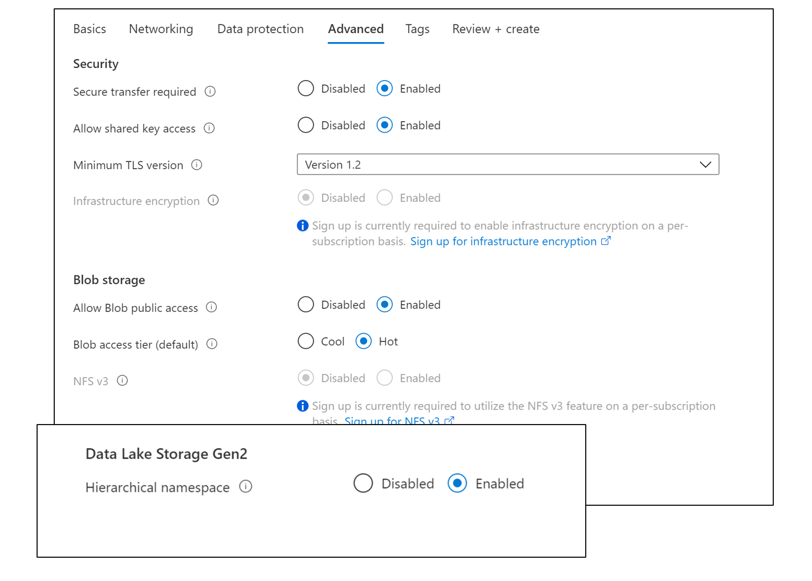

IoT Streaming Use Case
======================

Reference Documents:

[Tutorial: Migrate event data to Azure Synapse Analytics - Azure Event Hubs \|
Microsoft
Docs](https://docs.microsoft.com/en-us/azure/event-hubs/store-captured-data-data-warehouse)

[Tutorial: Create Apache Spark job definition in Synapse Studio - Azure Synapse
Analytics \| Microsoft
Docs](https://docs.microsoft.com/en-us/azure/synapse-analytics/spark/apache-spark-job-definitions#prerequisites)

[Azure Synapse Analytics - Azure Databricks - Workspace \| Microsoft
Docs](https://docs.microsoft.com/en-us/azure/databricks/data/data-sources/azure/synapse-analytics#usage-streaming)

[azure-event-hubs-spark/README.md at master · Azure/azure-event-hubs-spark
(github.com)](https://github.com/Azure/azure-event-hubs-spark/blob/master/README.md)

Main Steps:

1.  Create ADLS Gen2 Data lake

2.  Create Event Hub Namespace & Event Hub

3.  Create .NET application to send events to event hub

4.  Create ADLS Gen2 Instance – In portal select storage account

On advanced tab – select the hierarchal name space.

Note: [Soft delete for blobs - Azure Storage \| Microsoft
Docs](https://docs.microsoft.com/en-us/azure/storage/blobs/soft-delete-blob-overview)

1.  Create Event Hub Instance setup as streaming source

2.  Search for Event Hubs in Portal

1.  Provide Resource Group Name

1.  Setup Basics

1.  Deploy

1.  Create Event Hub

\-Create Event Hub

Select ADLS Gen 2 - & Create a new Storage Container.

Hit the select button.

Get Connection String

Grab Connection String, we will use it late.

Create a Read/Write

1.  Create .NET application to send telemetry data to Azure Event Hub

If Configuring Databricks to consume event:

Create a Databricks Workspace

[azure-event-hubs-spark/README.md at master · Azure/azure-event-hubs-spark
(github.com)](https://github.com/Azure/azure-event-hubs-spark/blob/master/README.md)

Go to link of maven central

Install on a single node cluster.

\-Configure Event Hubs Spark Connnector (Databricks or Synapse)

leverage open source project on github

https://github.com/Azure/azure-event-hubs-spark/blob/master/README.md
